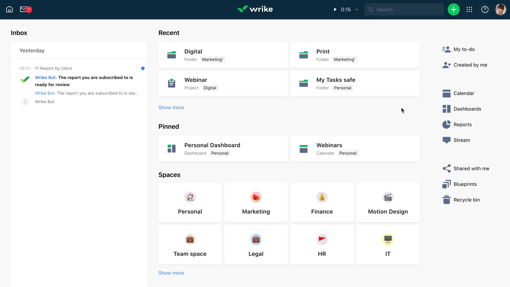

# [Wrike](https://www.wrike.com)

<a href='https://www.wrike.com'></img></a>

### Building Blocks of Wrike:

  <figure>
    
  </figure>

### Workspace:

  <figure>
    
  </figure>

### Create Space:

  <figure>
    
  </figure>

### Create Folder:

  <figure>
    
  </figure>

### Create Project:

  <figure>
    
  </figure>

